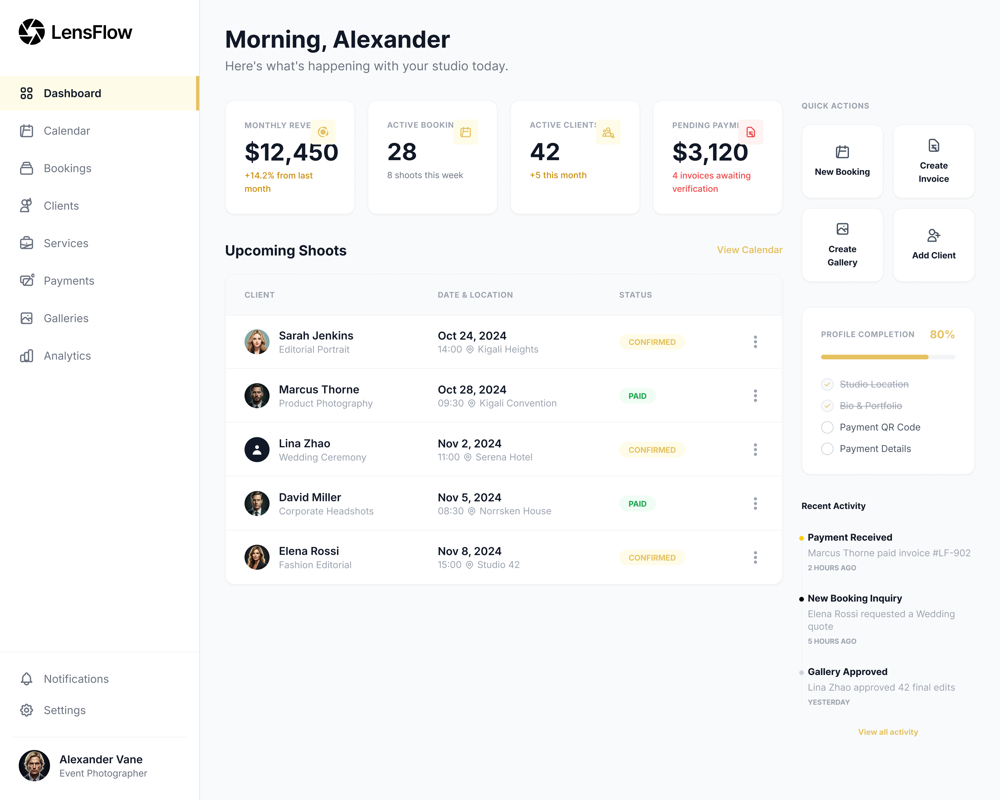
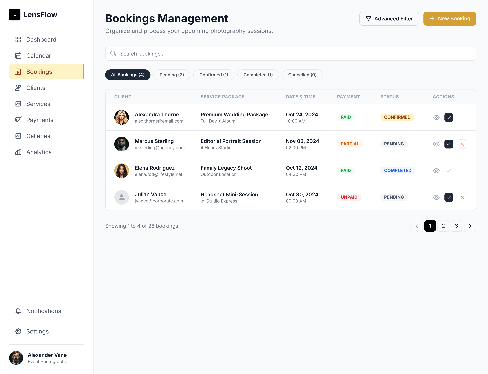
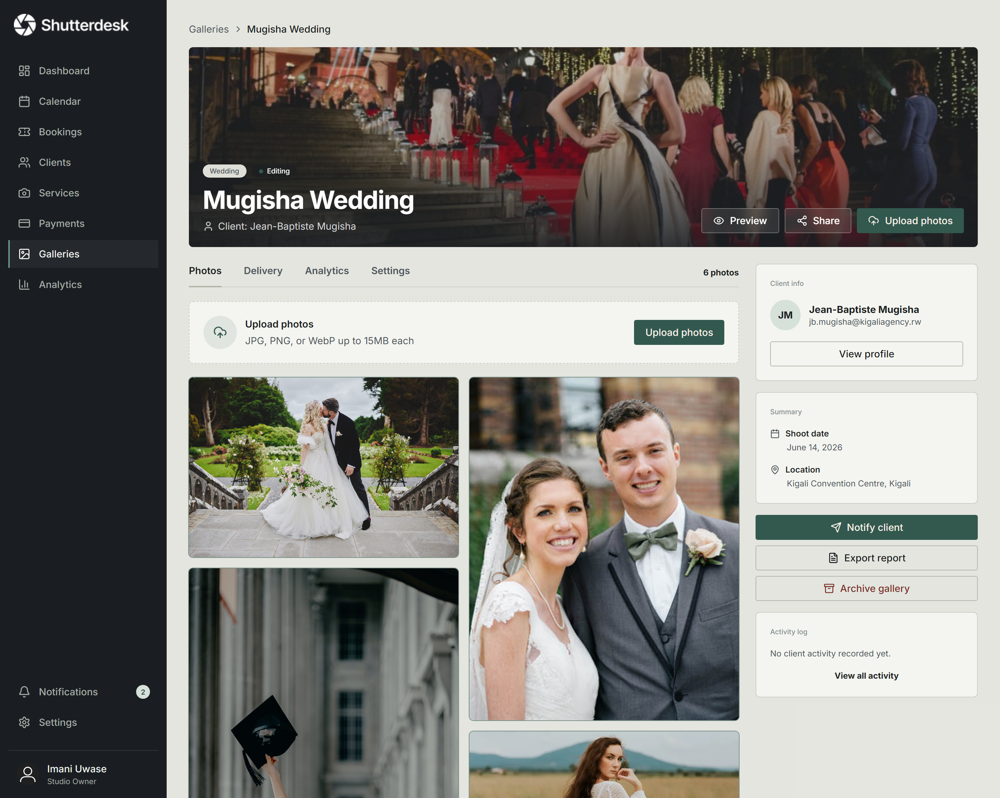

# Shutterdesk

**Photography studio management and client delivery platform** — built for photographers in Rwanda and beyond to manage bookings, clients, galleries, payments, and studio settings in one place.

- **Repository:** https://github.com/Elhameed/Shutterdesk
- **Live app:** _(redeploy pending — see [docs/DEPLOYMENT.md](docs/DEPLOYMENT.md))_
- **Demo video:** _(to be recorded)_

---

## Screenshots

| Landing | Dashboard |
|---------|-----------|
|  |  |

| Bookings | Gallery detail |
|----------|----------------|
|  |  |

---

## What it does

A full-stack web app where photographers run their business and deliver work to clients:

- **Dashboard** — bookings, revenue, and recent activity at a glance
- **Calendar & Bookings** — month view, create/track sessions with timeline
- **Clients (CRM)** — profiles and booking history
- **Services** — packages with pricing and deposit rules
- **Galleries** — create, deliver, PIN-protect, and let clients download photos
- **Payments** — MoMo/bank receipt verification queue
- **Analytics, Notifications, Settings** — revenue metrics, alerts, studio branding & preferences

Clients get their own portal to view bookings, pay deposits, and access delivered galleries.

## Tech stack

- **Frontend:** React 19, TypeScript, Vite, Tailwind CSS v4, React Router 7, TanStack Query, Axios
- **Backend:** Express 5, Prisma, PostgreSQL (Neon), JWT auth, Zod validation
- **Hosting:** Vercel (frontend) · Render (API) · Neon (database)

---

## Getting started

### Prerequisites

- Node.js 20 LTS (18+ works)
- npm 9+
- A PostgreSQL database (a free [Neon](https://neon.tech) project works well)

### 1. Clone and install

```bash
git clone https://github.com/Elhameed/Shutterdesk.git
cd Shutterdesk
npm install
cd server && npm install && cd ..
```

### 2. Configure environment variables

```bash
cp .env.example .env
cp server/.env.example server/.env
```

**`.env`** (frontend)

| Variable | Value |
|----------|-------|
| `VITE_API_URL` | `http://localhost:5000/api` |

**`server/.env`** (backend)

| Variable | Description |
|----------|-------------|
| `DATABASE_URL` | PostgreSQL connection string |
| `JWT_SECRET` | Any string, 32+ characters |
| `CORS_ORIGIN` | `http://localhost:5173` |
| `CLOUDINARY_*` | Needed for receipt & gallery uploads — see [docs/CLOUDINARY.md](docs/CLOUDINARY.md) |

### 3. Set up the database

```bash
cd server
npx prisma migrate deploy
npm run db:seed     # optional: demo photographer, clients, bookings
cd ..
```

### 4. Run the app

```bash
npm run dev:all     # starts frontend + API together
```

Open **http://localhost:5173**.

### Demo login (after seeding)

| Email | Password |
|-------|----------|
| `imani.uwase@shutterdesk.rw` | `password123` |

For a blank database, run `npm run db:reset:clean` and register a new account.

---

## Useful scripts

| Command | Description |
|---------|-------------|
| `npm run dev:all` | Start frontend + API |
| `npm run build` | Type-check + production build |
| `npm run db:seed` | Seed demo data |
| `npm run db:reset:clean` | Wipe database for fresh-user testing |
| `npm run test:api` | API integration tests |
| `npm run test:e2e` | Playwright end-to-end tests |

## Related files & docs

| File | Purpose |
|------|---------|
| [docs/DEPLOYMENT.md](docs/DEPLOYMENT.md) | Step-by-step deploy to Vercel + Render + Neon |
| [docs/CLOUDINARY.md](docs/CLOUDINARY.md) | Media upload setup |
| [docs/TESTING.md](docs/TESTING.md) | Testing guide |
| [docs/ARCHITECTURE.md](docs/ARCHITECTURE.md) | How the codebase fits together, folder conventions, core flows |
| [render.yaml](render.yaml) | API deployment config |

---

## Designs

**Figma:** https://www.figma.com/design/yatIF595LiAST1OE4BR8bO/LensFlow?node-id=153-752&t=iAWwWQhnRpEcKs5e-1

_(Figma resolves by file key, so this link works regardless of the file's display name —
rename the file in Figma when convenient and update the slug here.)_

---

## Project history

Shutterdesk continues a project originally developed as **LensFlow** by Athanson
Oluwasijibomi. It was transferred to **Abdulhameed Teniola Ajani**, who has maintained
and developed it since August 2026.
