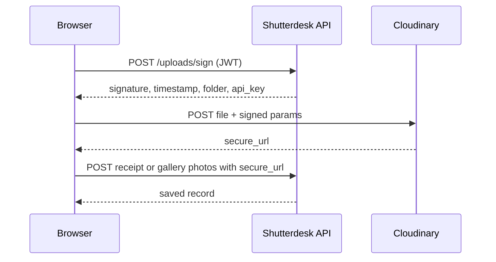

# Shutterdesk — Cloudinary Setup

Shutterdesk stores **MoMo payment receipts**, **gallery photos**, **profile avatars**, and **service cover images** in [Cloudinary](https://cloudinary.com). The browser uploads directly to Cloudinary using **signed upload parameters** from the Shutterdesk API (your API secret never leaves the server).

---

## 1. Create a Cloudinary account

1. Go to [cloudinary.com/users/register/free](https://cloudinary.com/users/register/free) and sign up (free tier is enough for development).
2. Open the **Dashboard** — note your:
   - **Cloud name**
   - **API Key**
   - **API Secret** (click “Reveal”)

---

## 2. Folder structure

Shutterdesk uploads into a single prefix (default `shutterdesk`) with context subfolders:

| Folder | Purpose | Who uploads |
|--------|---------|-------------|
| `shutterdesk/receipts` | MoMo payment receipt images & PDFs | Client |
| `shutterdesk/galleries` | Delivered gallery photos | Photographer |
| `shutterdesk/avatars` | Profile photos (client & photographer) | Client, Photographer |
| `shutterdesk/services` | Service package cover images | Photographer |

You do **not** need to create these folders manually — Cloudinary creates them on first upload.

To use a different prefix (e.g. staging), set `CLOUDINARY_FOLDER_PREFIX` in `server/.env`:

```env
CLOUDINARY_FOLDER_PREFIX=shutterdesk-staging
```

---

## 3. Configure `server/.env`

Add these variables (see `server/.env.example`):

```env
CLOUDINARY_CLOUD_NAME=your_cloud_name
CLOUDINARY_API_KEY=your_api_key
CLOUDINARY_API_SECRET=your_api_secret
CLOUDINARY_FOLDER_PREFIX=shutterdesk
```

Restart the API after changing env vars (`npm run dev:server` or `npm run dev:all`).

If Cloudinary is **not** configured:

- `POST /api/*/uploads/sign` returns **503** with a clear message.
- Receipt submission requires a real upload (no mock receipt fallback).

---

## 4. How uploads work



### Endpoints

| Role | Sign upload | Save metadata |
|------|-------------|---------------|
| Client | `POST /api/client/uploads/sign` `{ "context": "receipts" \| "avatars" }` | Receipts → `POST /api/client/payments/receipts`; avatars → `PATCH /api/client/settings` |
| Photographer | `POST /api/photographer/uploads/sign` `{ "context": "galleries" \| "avatars" \| "services" }` | Galleries → `POST /api/photographer/galleries/:id/photos`; avatars → `PATCH /api/photographer/settings/profile`; services → `POST/PATCH /api/photographer/services` |

- **Images** (JPG, PNG, WebP) use `resourceType: "image"`.
- **PDF receipts** use `resourceType: "raw"`.

---

## 5. Cloudinary dashboard settings (recommended)

1. **Settings → Security**
   - Enable **Strict Transformations** when you add image transforms in production.
   - Restrict allowed formats if desired (`jpg`, `png`, `webp`, `pdf`).

2. **Settings → Upload**
   - Default upload preset is **not** required — Shutterdesk uses signed uploads.

3. **Media Library**
   - After testing, browse `shutterdesk/receipts` and `shutterdesk/galleries` to confirm files land in the right folders.

---

## 6. Production (Render)

Add the same four `CLOUDINARY_*` variables to your Render service environment. No frontend env vars are needed — uploads are signed server-side.

---

## 7. Local testing checklist

1. Configure `server/.env` with Cloudinary credentials.
2. Run `npm run dev:all`.
3. **Client:** Payments → upload receipt.
4. **Client:** Settings or onboarding → upload profile photo → save.
5. **Photographer:** Settings profile panel or onboarding → upload avatar.
6. **Photographer:** Services → create package → upload cover image.
7. **Photographer:** Gallery detail → Upload Photos.
8. Verify URLs in API responses start with `https://res.cloudinary.com/<your-cloud-name>/`.

---

## Troubleshooting

| Issue | Fix |
|-------|-----|
| `Cloudinary is not configured` | Add all three `CLOUDINARY_* creds to `server/.env` and restart API |
| `Invalid signature` | Check API secret; ensure server clock is reasonable |
| `Invalid receipt upload source` | Receipt URL must be from your Cloudinary cloud |
| CORS on upload | Cloudinary allows browser uploads by default for signed requests |
| PDF preview blank | Expected — PDFs show filename only until opened via URL |
